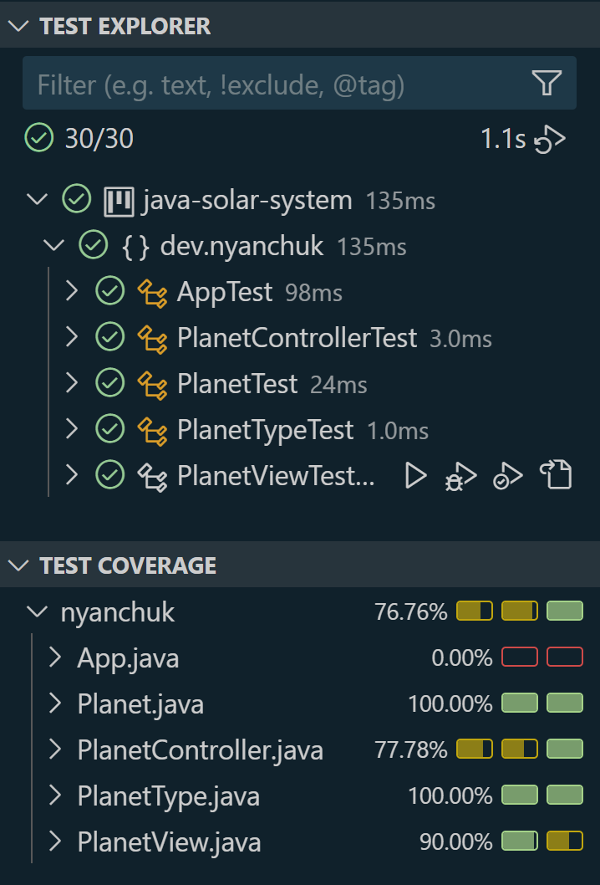
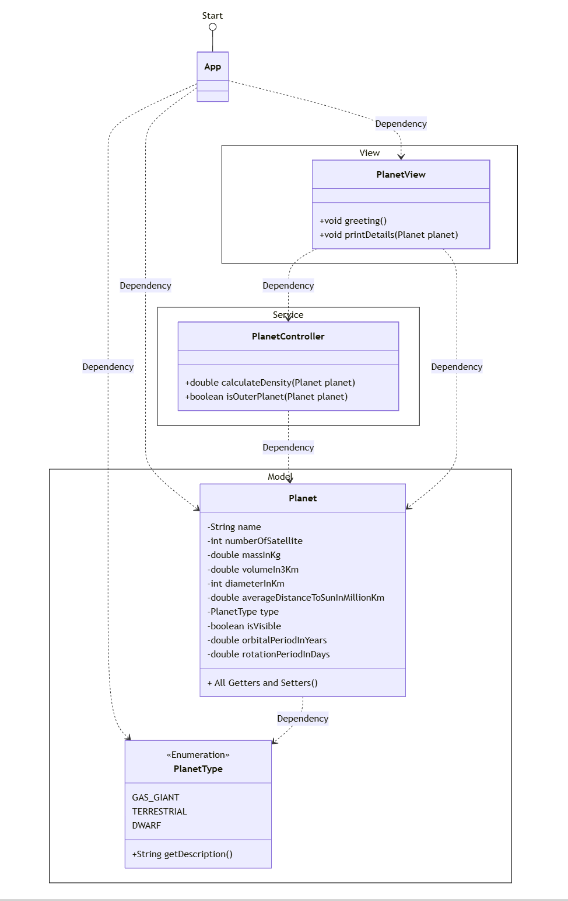

# Solar System Project

## Description

This project simulates the concept of a planet in the solar system. It allows the user to create planets, calculate their properties such as density, and determine whether a planet is an outer planet based on its distance from the Sun.

### Planet Attributes:
- **Name**: A string, initially null.
- **Number of Satellites**: An integer, initially 0.
- **Mass**: A double representing the mass in kilograms, initially 0.
- **Volume**: A double representing the volume in cubic kilometers, initially 0.
- **Diameter**: An integer representing the diameter in kilometers, initially 0.
- **Average Distance to the Sun**: An integer representing the distance in millions of kilometers, initially 0.
- **Planet Type**: An enum (Gaseous, Terrestrial, or Dwarf).
- **Observable to the Naked Eye**: A boolean, initially false.

### Features:
- Constructor to initialize planet attributes.
- Method to return planet attributes.
- Method to calculate the density of a planet.
- Method to check if a planet is an outer planet (beyond the asteroid belt).
- The asteroid belt is located between 2.1 and 3.4 AU (Astronomical Units).

### Expansion:
- Added two attributes:
  - **Orbital Period** (in years)
  - **Rotation Period** (in days)
- Modified constructor to initialize these new attributes.
- Modified the print method to display the new attributes.

## Example Console Interaction

    Planet Name: Mercury
    Number of Satellites: 0
    Mass: 3.3E23 kg
    Volume: 6.083E13 km³
    Diameter: 4880 km
    Average Distance to Sun: 57.9 million km
    Planet Type: Terrestrial
    Observable to the naked eye: true
    Orbital Period: 0.24 Earth years
    Rotation Period: 58.6 days
    Density: 5.4249547920434E9
    Is Outer Planet: false

## Installation Steps

1. Clone the repository:
    
    git clone https://github.com/NelliYanchuk/java-solar-system.git

2. Navigate to the project folder:
    
    cd java-solar-system

3. Build and run the project using your preferred IDE or command line.

## Test Execution

To run the tests:

1. Ensure that JUnit 5 is included in your project dependencies.
2. Run the tests through your IDE or via command line using Maven/Gradle.

## Diagrams
Include diagrams such as:
- **Test Coverage Diagram**:

- **Class Diagram**:

## Author
**Nelli Yanchuk** - Developer

Contact me with: [GitHub](https://github.com/NelliYanchuk) / [LinkedIn](https://www.linkedin.com/in/nelli-yanchuk-a24b81138/)